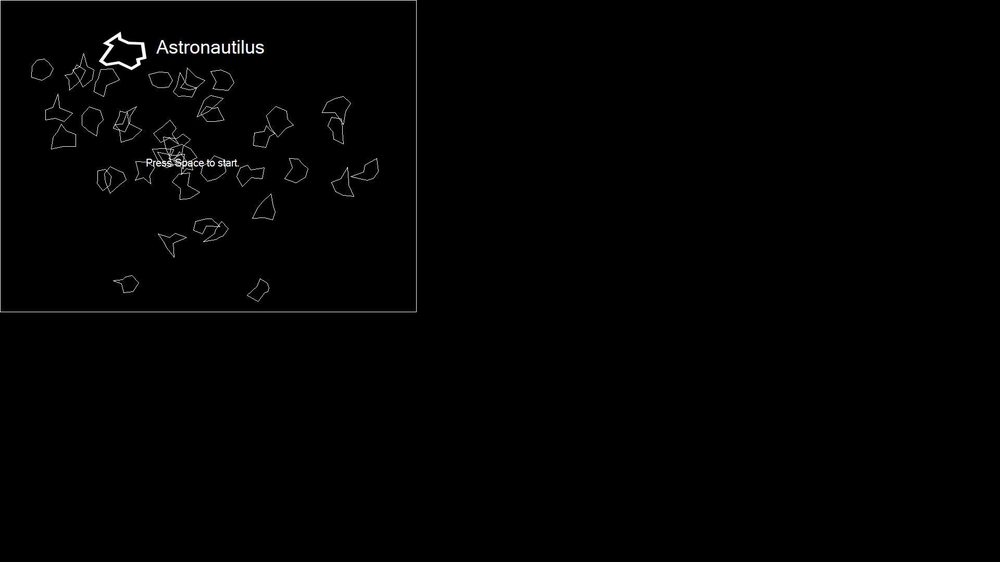
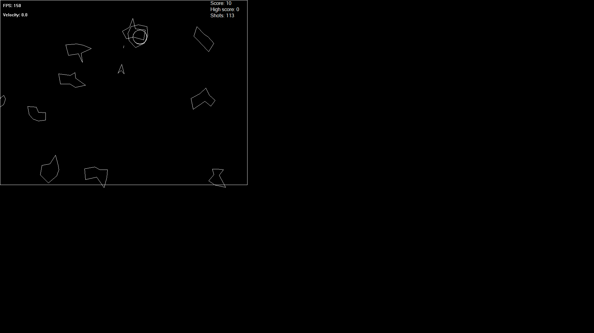

# Astronautilius

Astronautilius is a retro space shooter game inspired from original atari game "Asteroids" made in CPP.

# Compiling
The graphics library currently supports '''Visual Studio 2019''' only and compiles on x86.

# Screenshots

